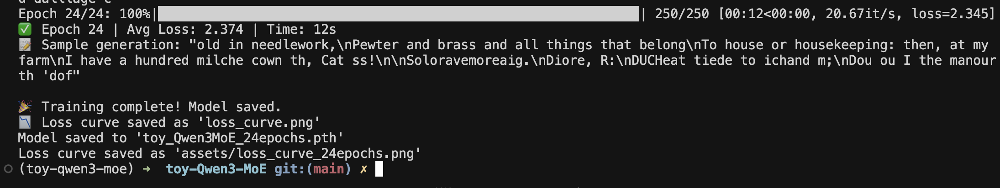
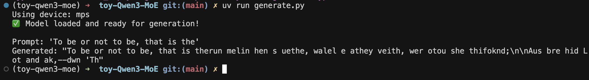
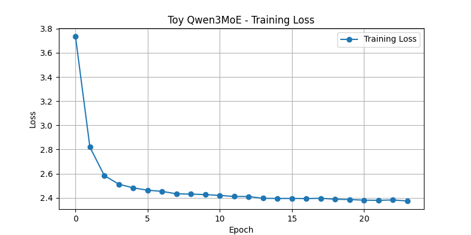

# 🧠 Toy Qwen3MoE - Character-Level LLM

A **toy implementation of Qwen3MoE architecture** for learning purposes. This project trains a character-level language model using a simplified version of the Qwen3MoE transformer architecture. The model learns to generate Shakespeare-like text based on input prompts.

> ⚠️ **Disclaimer**: This project is for **educational purposes only**. It is a minimal and experimental implementation. There might be inaccuracies, oversights, or suboptimal decisions. Please feel free to open issues or share suggestions!

---

## ✨ Features

- Character-level tokenizer
- Configurable transformer architecture (Qwen3MoE-inspired)
- Loss plotted and saved over training epochs
- Generation script with support for temperature sampling
- MPS (Mac) and CUDA GPU support with `autocast` context

---

## 📈 Training Results

Trained for **24 epochs** on Shakespeare dataset (char-level) using MPS device. Final training loss: **~2.374**.

### 🔹 Training Output



### 🔹 Generated Text



### 🔹 Loss Curve



---

## 🛠️ Usage

### 1. Train the model
```bash
uv run train.py
```

### 2. Generate text
```bash
uv run generate.py
```

---

## 📁 Directory Structure

```
toy-qwen3MoE/
│
├── src/
│   └── toy_qwen3MoE/
│       └── model.py          # Model architecture
│
├── assets/
│   └── loss_curve_24epochs.png
│
├── train.py                  # Training loop
├── generate.py               # Text generation
├── char_vocab.json           # Character-level vocab
├── toy_qwen3MoE_24epochs.pth    # Trained model weights (gitignored)
├── README.md
└── .gitignore
```

---

## 🙏 Acknowledgements

Thanks to the open-source community for resources and ideas. Special thanks to the Qwen team for releasing their architecture and inspiring learning projects like this.

---

## 📌 Notes

- The model weights (`*.pth`) are excluded from the repo.
- Results may vary based on training duration and device.
- The implementation prioritizes readability and learning over efficiency.